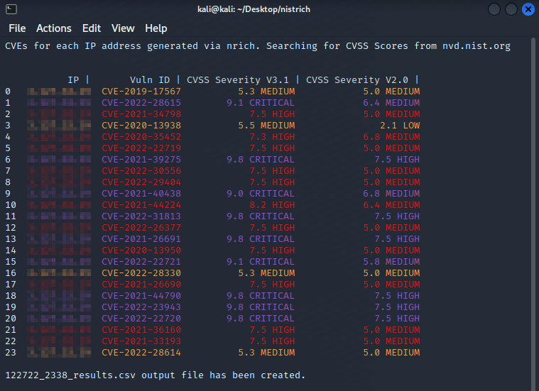

## Description:

nistrich allows you to discover CVEs and their severities belong to IP addresses. 




## Installation:

install nrich before using nistrich
```bash
$ wget https://gitlab.com/api/v4/projects/33695681/packages/generic/nrich/latest/nrich_latest_amd64.deb
$ sudo dpkg -i nrich_latest_amd64.deb
```
installation of nistrich
```bash
$ git clone https://github.com/webemin/nistrich
$ cd nistrich
$ pip install -r requirements.txt
$ chmod +x nistrich.sh
$ ./nistrich.sh -h
```

## Usage:

for one ip address

```bash
$ ./nistrich.sh -i <single ip address>
```

for IPs in bulk

```bash
$ ./nistrich.sh -l <ip addresses in bulk (per line 1 ip)>
```